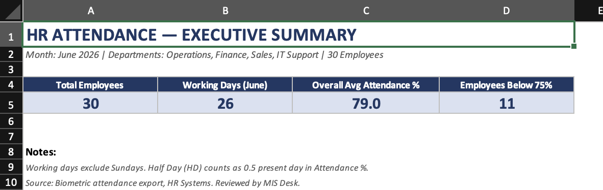
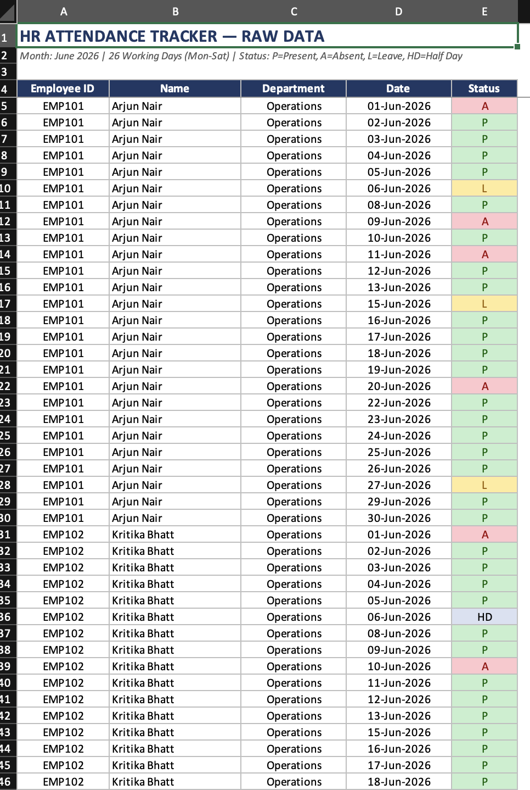
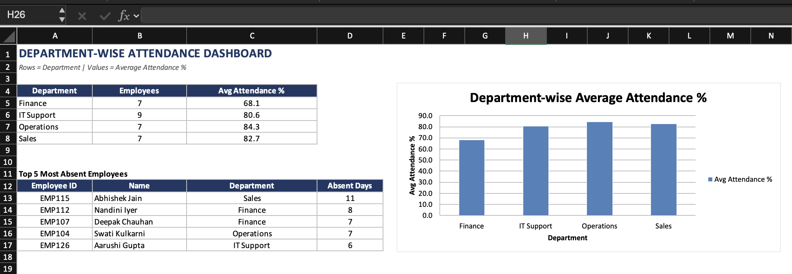

# HR-Attendance-Dashboard
Excel-based HR MIS dashboard developed to monitor employee attendance, department-wise performance, absenteeism trends and workforce availability. The project demonstrates practical MIS reporting used by HR operations teams through dashboards, Pivot Tables and KPI tracking.

# HR Attendance Dashboard

## Project Overview

This project showcases an HR Attendance MIS Dashboard built entirely in Microsoft Excel.

It transforms daily attendance records into management reports that support workforce planning and employee attendance monitoring.

---

## Business Problem

Manual attendance tracking often makes it difficult to monitor

- Department performance
- Employee attendance
- Low attendance employees
- Overall workforce availability

This workbook automates attendance reporting.

---

## Dataset Summary

| Metric | Value |
|---------|------:|
| Employees | **30** |
| Working Days | **26** |
| Average Attendance | **79.04%** |
| Employees Below 75% | **11** |

---

## Dashboard Components

### Executive Summary

Displays

- Total Employees
- Working Days
- Attendance %
- Employees Below Threshold

---

### Employee Summary

Shows

- Present Days
- Leave
- Half Days
- Absent Days
- Attendance %
- Employee Ranking

---

### Department Dashboard

Compares

| Department | Attendance |
|------------|-----------:|
| Operations | **84.34%** |
| Sales | **82.69%** |
| IT Support | **80.56%** |
| Finance | **68.13%** |

---

## Key Insights

- Overall attendance reached **79.04%**.
- **11 employees** recorded attendance below **75%**.
- Operations achieved the highest attendance at **84.34%**.
- Finance reported the lowest departmental attendance (**68.13%**), indicating potential staffing concerns.
- Dashboard highlights top absenteeism trends for targeted HR follow-up.

---

## Excel Skills Used

- Pivot Tables
- Conditional Formatting
- COUNTIFS
- SUMIFS
- IF Functions
- Data Validation
- Dashboard Design
- Attendance Calculations
- KPI Reporting

---

## Skills Demonstrated

- HR MIS Reporting
- Attendance Analytics
- Workforce Monitoring
- Dashboard Reporting
- Excel Automation
- HR Operations

---

## Screenshots

### Executive Dashboard

### Attendance Sheet

### Department Dashboard

---

## Suitable For

- HR MIS Executive
- MIS Executive
- HR Operations
- Workforce Analytics
- Administration
